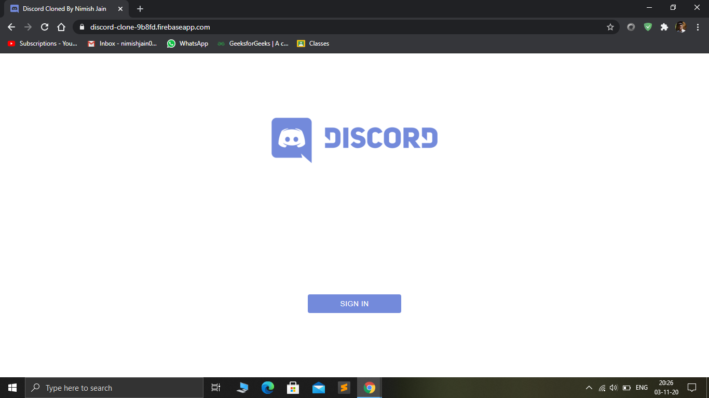
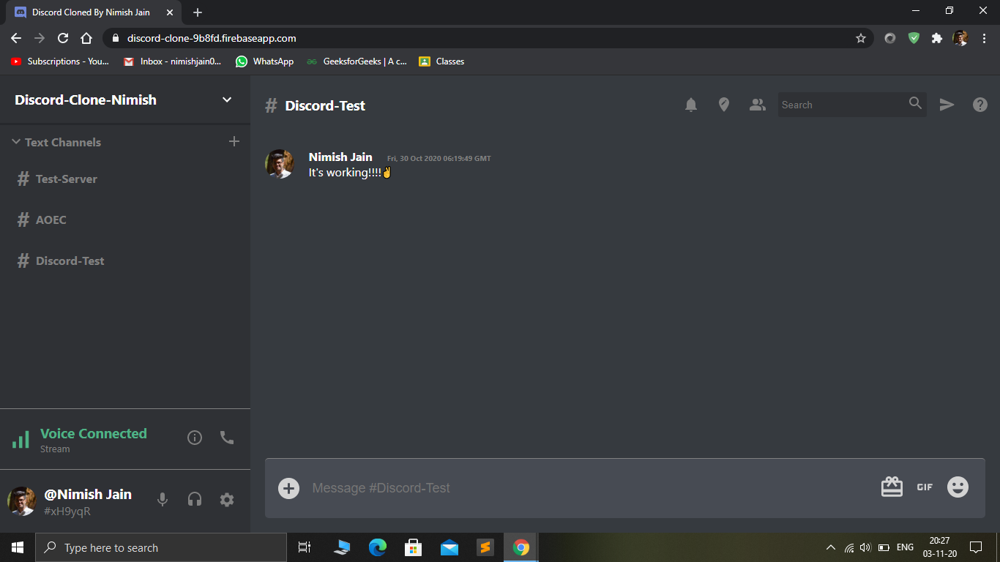
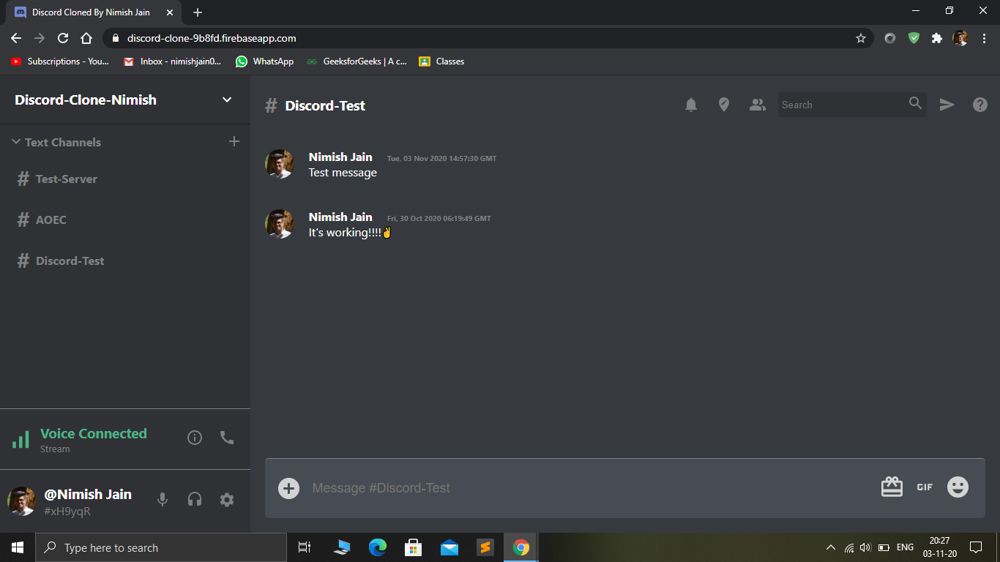
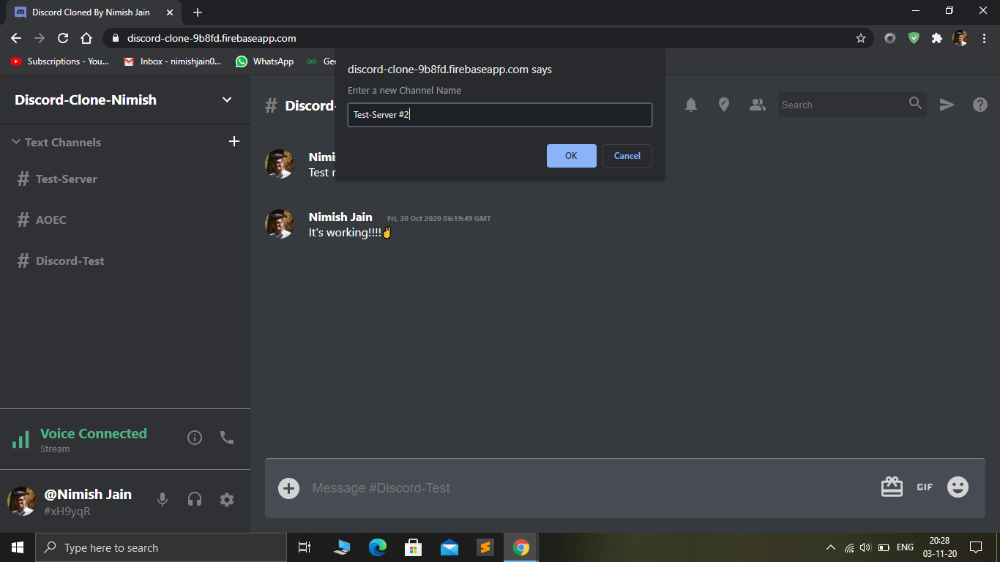
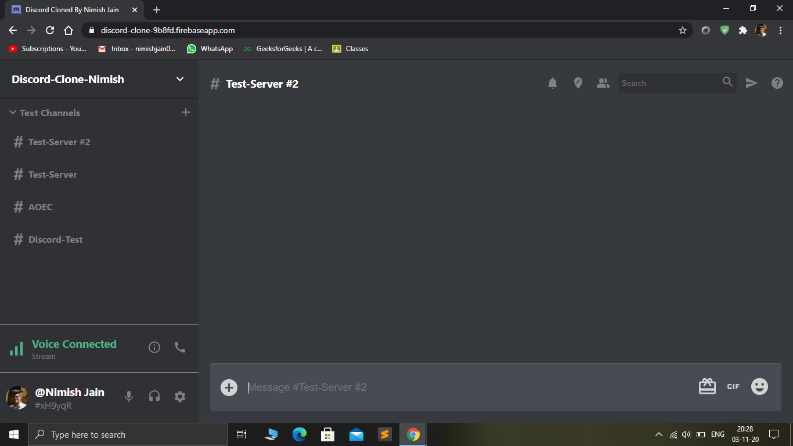
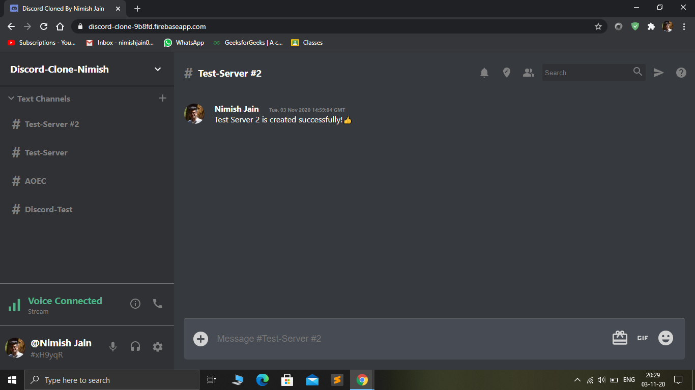
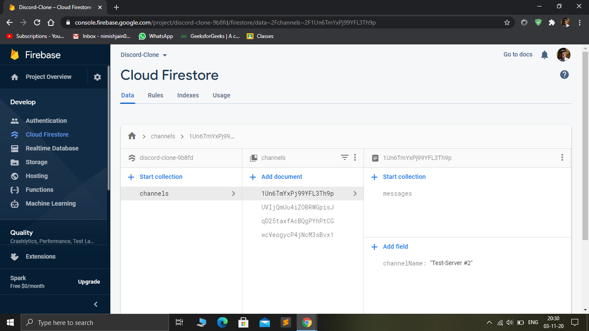

#Discord-Clone using React & Redux

This is a cloned version of one of the most popular chat applications in the world, Discord. It is an exact clone of Discord, same UI, Google Sign In, and everything.
Functionality is also just like the original part. We get to do the following things :
  1. Sign In using Google Authentication with a single click.
  2. Create Servers
  3. Click on any server and Chat with people real-time.
  4. Sign Out with one click.

##Tech-Stack

  1. HTML
  2. CSS
  3. Material UI
  4. ES6,ES7 Javascript
  5. React JS
  6. Redux
  7. Firebase & Store
  
The Database is managed using Firestore, & the website is hosted using Firebase. You can go ahead and try it from the following link : https://discord-clone-9b8fd.firebaseapp.com

Here are some Screenshots from the live website

